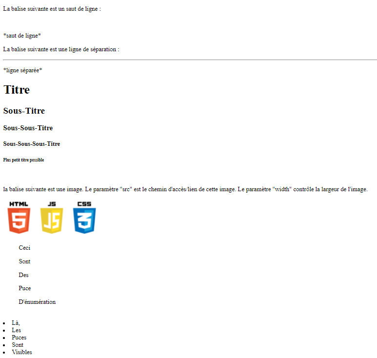

# Créer Notre Site

## Introduction à l'IDE

Un IDE ("Integrated Development Environment" ou environnement de développement intégré) est un ensemble d'outils qui permet d'augmenter la productivité des développeurs. Il comporte un éditeur de texte destiné à la programmation ainsi que d'autres fonctions qui ne seront pas abordées ici.
L’éditeur de texte compris dans l'IDE permet le plus souvent d'alerter le développeur d'une erreur dans son code. Ou encore, directement aider celui-ci en auto-complétant son code.

Certains environnements sont dédiés à un langage de programmation en particulier et/ou sont payants.

Voici une liste non exhaustive d'IDEs :

- PyCharm : Destiné uniquement à Python (Par JetBrains) Payant
- Visual Studio Code : multi langage (Par Microsoft) Gratuit
- Eclipse : Destiné uniquement au Java (Par la Fondation Eclipse) Gratuit
- PhpStorm : Destiné uniquement au PHP (Par JetBrains) Payant
- GoLand : Destiné uniquement au Go (Par JetBrains) Payant
- Sublime Text : multi langage (Par Sublime HQ) Gratuit
- IntelliJ IDEA : Destiné au Java (Par JetBrains) Payant
- Notepad++ : multi langage (Par Don Ho) Gratuit

[<br>](br)
[<br>](br)

[](media/JetBrains.png)

*JetBrains*

[](media/Eclipse.png)

*Eclipse*

[](media/vscode.png.png)

*Visual Studio Code*

[<br>](br)
[<br>](br)
[<br>](br)


## Installation de l'IDE Visual Studio Code

Pour commencer à créer notre site, nous allons donc avoir besoin d'un IDE. Pour ce faire, nous allons installer VS Code qui est un IDE directement développé par Microsoft et qui est pleinement capable de nous assister dans le développement de notre site.

Pour ce faire, nous allons nous rendre à [cette](https://code.visualstudio.com) adresse

Puis,

[](media/vscode-dl-1.png)

Enfin, complétez le deamon d’installation :

[<video width="720" controls muted><source src="media/vscode_dl-setup.mp4" type="video/mp4"></video>](media/vscode_dl-setup.mp4)

Visual Studio est désormais installé sur votre machine.

[<br>](br)
[<br>](br)


## Création de la page de notre site
### Introduction au HTML
#### Créer notre premier fichier
Le HTML est le langage de programmation principal interprété par le navigateur internet. C’est en HTML que toutes les pages webs sont créées

Nous allons à présent préparer notre IDE au développement HTML :

[<video width="720" controls muted><source src="media/vscode-prepare.mp4" type="video/mp4"></video>](media/vscode-prepare.mp4)

Puis créer la base de notre page grâce à l’auto-complétions de VS Code :

[<video width="720" controls muted><source src="media/html-createfile.mp4" type="video/mp4"></video>](media/html-createfile.mp4)

[<br>](br)

#### Décomposition du code

```xml
<!DOCTYPE html>
```
Cette première ligne précise que le document qui vas suivre est un document HTML

---

```xml
<html lang="en">
```
Celle-ci, ouvre la balise "html" et précise que la page est écrite en anglais (en : English). On peut modifier le "en" en "fr" (français).

---

```xml
<head>
    <meta charset="UTF-8">
    <meta http-equiv="X-UA-Compatible" content="IE=edge">
    <meta name="viewport" content="width=device-width, initial-scale=1.0">
    <title>Document</title>
</head>
```
Ce bloc est encadré par la balise "head". Elle s'ouvre par <head> et se ferme par </head>.
Les informations comprises dans cette balise donne au navigateur des informations comme l'encodage de la page (``<meta charset="UTF-8">``) ou encore le titre de celle-ci (``<title>Document</title>``). A noter que le titre "Document" est compris dans la balise "titre" (elle-même comprise dans la balise "head", elle-même comprise dans la balise "html"). Ce principe de "balisage" et "compris entre" est déterminent dans le HTML.
Pour ce qui est des autres informations présentent dans "head", elles ne nous sont pas utiles pour le moment. Nous n’y toucherons pas

[](media/page-title.png)

*Titre de la page*

Nous pouvons modifier le titre en "Page De Test". Cela donne :

```xml
<title>Page De Test</title>
```

---

```xml
<body>
    
</body>
```

La balise "body" comprend le "corps" de la page c'est-à-dire l'entièreté de la page affichée. C'est là que nous écrirons notre code.

---

```xml
</html>
```

Cette ligne a pour but de refermer la balise "html". On note que l'ouverture d'une balise se fait par :

```
<*nom de la balise* *paramètre de la balise*>
```

Et sa fermeture :

```
</*nom de la balise*>
```

On constate aussi que les balises comme "meta", ne se ferment pas. Nous verrons d'autres balises comme celle-ci.

[<br>](br)

#### Ouverture du code dans le navigateur

Nous allons à présent essayer d'afficher une simple ligne de texte dans notre page (donc dans la balise "body"). Pour ce faire, utilisons la balise "p" :

```xml
<body>
    <p>Hello World !</p>
</body>
```

Chaque balise "p" représente une ligne à part entière.

Nous pouvons désormais afficher la page web navigateur :

[<video width="720" controls muted><source src="media/export-page-in-nav.mp4" type="video/mp4"></video>](media/export-page-in-nav.mp4)

[<br>](br)

#### A la découverte des balises HTML

Nous connaissons les balises "html", "head", "meta", "body" et "p". Mais ce ne sont pas les seules, loin de là...

La balise "strong" permet, elle d'afficher du texte en gras. La "i", en italique. La "u", souligné. Et la "del", barré. Chaque balises peuvent bien sûr être comprises dans d'autres :

```xml
<body>
    <p>Hello World !</p>
    <p>Ceci est un saut de ligne</p>
    <p><strong>Ce texte est écrit en gras</strong></p>
    <p>Ce texte là est quand à lui souligné : <u>je suis un texte souligné</u></p>
    <p>Nous <i>pouvons</i> utiliser <strong>les balises comme <del>ceci</del></strong></p>
    <strong><i><u><p>en se rappelant que</p>
        <p>les balises peuvent</p>
        <p>être comprises dans d'autres</p></u></i></strong>
</body>
```

Résultat :

[](media/html-1.png)

---

Voici d'autres balises utiles :

```xml
<body>
    <p>La balise suivante est un saut de ligne : </p>
    <br>
    <p>*saut de ligne*</p>
    <p>La balise suivante est une ligne de séparation : </p>
    <hr>
    <p>*ligne séparée*</p>
    <h1>Titre</h1>
    <h2>Sous-Titre</h2>
    <h3>Sous-Sous-Titre</h3>
    <h4>Sous-Sous-Sous-Titre</h4>
    <h6>Plus petit titre possible</h6>
    <br>
    <p>la balise suivante est une image. Le paramètre "src" est le chemin d'accès/lien de cette image. Le paramètre "width" contrôle la largeur de l'image.</p>
    
    <ul>Ceci</ul>
    <ul>Sont</ul>
    <ul>Des</ul>
    <ul>Puce</ul>
    <ul>D'énumération</ul>
    <br>
    <li>Là,</li>
    <li>Les</li>
    <li>Puces</li>
    <li>Sont</li>
    <li>Visibles</li>
</body>
```

Résultat :

[](media/html-2.png)

[<br>](br)


### A la découverte du CSS

Le CSS est un langage de programmation à part qui viens se greffer à notre fichier HTML par l'intermédiaire de la balise "style" qui se place dans le "head".
Ce langage vas nous permettre de mettre en forme notre page web (modifier la couleur, la taille, la police...)

Créons le fichier CSS dans notre projet :

[<video width="720" controls muted><source src="media/creation-du-fichier-css.mp4" type="video/mp4"></video>](media/creation-du-fichier-css.mp4)

Pour intégrer le fichier à la page html, il faut ajouter la balise suivante dans le head :

```xml
<link rel="stylesheet" href="style.css">
```

Éditons maintenant le fichier CSS.

Un bloc CSS s'articule de la façon suivante :

```
*sélecteur CSS* {
    *attributs*;
    *attributs*;
    *attributs*;
    ...
}
```

Le sélecteur CSS vas dire au navigateur sur quels éléments HTML les changements devront être effectués. A noter qu'à la fin de chaque lignes, un ";" est placé.
Pour mettre tous les "h1" en rouge, le code sera le suivant :

```css
h1 {
    color : red;
}
```

Pour mettre le fond d'écran en noir et tous les éléments en blanc (sauf si précisions contraires) : 

```css
body {
    background-color: black;
    color: white;
}
```

Ici, tous les éléments compris dans la balise body (soit tous les éléments affichés) héritent des attributs de cette dernière, sauf précisions contraires.

On a, dans notre fichier CSS :

```css
h1 {
    color : red;
}

body {
    background-color: black;
    color: white;
}
```

On a, dans notre fichier HTML :

```xml
<!DOCTYPE html>
<html lang="fr">
<head>
    <meta charset="UTF-8">
    <meta http-equiv="X-UA-Compatible" content="IE=edge">
    <meta name="viewport" content="width=device-width, initial-scale=1.0">
    <title>Document</title>
    <link rel="stylesheet" href="style.css">
</head>
<body>
    <p>Normal</p>
    <p><strong>Gras</strong></p>
    <p><u>Souligné</u></p>
    <p><del>Barré</del></p>
    <p><i>Italique</i></p>
    <h1>Titre</h1>
    <h2>Sous-Titre</h2>
    <h2><strong>Sous-Titre + Gras<strong></h2>
</body>
</html>
```

Résultat :

[](media/css-1.png)

Les sélecteurs CSS peuvent s'avérer, parfois, très limités. C'est pourquoi, nous allons découvrir deux autres moyens de sélection CSS :

[<br>](br)

#### Les class

Class est un paramètre de balise HTML qui nous permettra de le sélectionner dans notre fichier CSS.
On l'écrit comme ceci :

```xml
<p class="leNomDeMaClass">Normal</p>
```

Dans le CSS, nous pouvons le sélectionner comme ceci :

```css
.leNomDeMaClass {
    color : green;
}
```

Un "." est placé devant le sélecteur pour préciser qu'il s'agit d'une classe et non d'un type d'élément.

[<br>](br)

#### Le style

Style aussi est un paramètre de balise HTML. Il injecte directement du code CSS dans notre balise :

```xml
<p style="color:green;">Normal</p>
```

Nous pouvons combiner ces 3 méthodes de sélections :

Code HTML :

```xml
<!DOCTYPE html>
<html lang="fr">
<head>
    <meta charset="UTF-8">
    <meta http-equiv="X-UA-Compatible" content="IE=edge">
    <meta name="viewport" content="width=device-width, initial-scale=1.0">
    <title>Intro au HTML/CSS</title>
    <link rel="stylesheet" href="style.css">
</head>
<body>
    <p style="color:red;">avec style de couleur rouge</p>
    <p><strong>Gras</strong></p>
    <p><u>Souligné</u></p>
    <p><del>Barré</del></p>
    <p><del class="vert">Barré avec la classe "vert"</del></p>
    <p><i class="vert">Italique avec style de taille de texte 50px (pixels) et classe "vert" </i></p>
    <h1>Titre</h1>
    <h2>Sous-Titre</h2>
    <h2><strong>Sous-Titre + Gras<strong></h2>
    <h1 class="big">Titre avec classe "big"</h1>
</body>
</html>
```

Code CSS :

```css
h1 {
    color : red;
}

body {
    background-color: black;
    color: white;
}

.vert {
    color : green;
}

del.vert {
    font-size: 50px;
}

.big {
    font-size: 80px;
    padding : 60px;
}

h2 strong {
    color: aqua;
}
```
Ici, font-size détermine la taille (px veut dire pixels mais d'autres unités de mesures sont possibles) de la police. Et padding, détermine la marge (universelle c'est-à-dire dans toutes les directions : haut, bas, gauche, droite) de notre élément.

|Attribut CSS  |Utilité                        |
|--------------|--------------------------------|
|padding-left  |Marge à gauche                  |
|padding-top   |Marge en haut                   |
|padding-bottom|Marge en bas                    |
|padding-right |Marge à droite                  |
|padding       |Marge dans toutes les directions|


Résultat :

[](media/css-2.png)

[<br>](br)


### Quelques autres attributs CSS / éléments HTML

Les div sont des éléments html qui se comportent comme des boîtes. En effet, nous pouvons ranger à l'intérieur de celles-ci du texte, des images, des titres, des vidéos... et organiser ces boîtes dans la page. A noter que des div peuvent en contenir d'autres, c'est d'ailleurs souvent le cas dans des grands sites.

Avent de travailler avec les div, quelques attributs CSS sont à voir :

|Attribut CSS  |Utilité                        |
|--------------|--------------------------------|
|margin  |Pareil que padding (il existe des margin-left, margin-right...) à l'exception du fait que les paddings sont des marges intérieurs et les margins des marges extérieur. Cette distinction devient importante quand on travaille avec des div|
|border|Définit les bordures. Syntaxe : "border : \*taille* \*format* \*couleur*;"|
|width|Longeur de l'élément|
|height|Hauteur de l'élément|


Page de présentation des divs :

Code HTML :

```xml
<!DOCTYPE html>
<html lang="fr"><head>
    <meta charset="UTF-8">
    <meta http-equiv="X-UA-Compatible" content="IE=edge">
    <meta name="viewport" content="width=device-width, initial-scale=1.0">
    <title>Intro au HTML/CSS</title>
    <link rel="stylesheet" href="style.css">
</head>
<body>
    <p>Ceci est un texte compris dans aucune div</p>
    <p>Les div sont</p>
    <p>ici :</p>
    <div style="border : 2px solid red;">
        <p>Cette div a une bordure rouge</p>
        <p>qui mesure 2 pixels d'épaisseur</p>
        <p>Toutes les divs sur cette page comportent des bordures pour être plus évidentes à la lecture de cette page.</p>
        <p>Mais rien ne vous empêche de les omettre</p>
        <div style="border : 10px dotted blue;">
            <p>Cette div comporte plusieurs divs à la fois</p>
            
            
            <div style="border : 10px dashed slateblue; background-color: black; color: aliceblue; padding-top : 10em">
                <p>Cette div à un fond de couleur noire.</p>
                <p>Et une marge intérieure (padding) de 10 em.</p>
                
            </div>
            <hr>
            <div style="border : 1em double salmon; margin-right: 60%; text-align: center;">
                <p>Cette div remplie 40% de la place en longueur.</p>
                <p>Soit une marge extérieure (margin) de 60%</p>
                <p>La bordure de cette div est « double » c’est-à-dire que l’on voit deux bordures.</p>
            <p>Mais c’en est qu’une seule.</p></div>
            <br>
            <br>
            <div style="border : 1em outset violet; margin-left: 50em;">
                <p>Marge éxterieure gauche (margin) de 50em.</p>
                <p>L’image qui va suivre n’est pas dans une div indépendante.</p>
                
                <p>L’attribut bordure lui a directement été injectée.</p>
            </div>
            <br>
            <br>
            <div style="border-bottom: 4mm solid black; border-top: 4mm dashed darkorange; border-right: 10vh solid rgb(41, 75, 211); width: 10%; height: 300px;">
                <p>Nous pouvons aussi gérer les côtés des bordures de façon indépendante.</p>
                
                <p>La div a une longueur de 10% et une hauteur de 300 pixels.</p>
            </div>
        </div>
    </div>

</body>
</html>
```

Code CSS :

```css
div {
    padding : 50px;
}

p {
    font-size: xx-large;
}
```

Résultat :

[](media/div.png)

[<br>](br)
[<br>](br)


# Publier Notre Site

## Publier notre site grâce à GitHub pages

GitHub est *la* plateforme de stockage de code pour développeur. Il agit comme un google drive, mais propose des outils dédiés et à une expérience optimisée pour le développement d'applications de tout langages de programmation.
GitHub propose une solution d'hébergement de sites statiques gratuite, très simple et optimisé pour les débutants.

Pour cela, il nous faut un compte GitHub.

Rendez-vous sur [cette](https://github.com/) page

[<video width="720" controls muted><source src="media/sing-up-github.mp4" type="video/mp4"></video>](media/sing-up-github.mp4)

Répondez aux dernières questions.
Vous devriez arriver sur cette page ci :
[](media/home-page-github.png)

Une fois-là,

[<video width="720" controls muted><source src="media/create-repo.mp4" type="video/mp4"></video>](media/create-repo.mp4)


Attendez quelques minutes le temps que le site se déploye. Puis rendez-vous sur l'adresse indiquée.
Votre site web est désormais visible depuis le monde entier grâce à ce lien.
[<br>](br)
[<br>](br)
[<br>](br)
[<br>](br)
[<br>](br)
[<br>](br)
[<br>](br)
[<br>](br)
[<br>](br)
[<br>](br)
[<br>](br)
[<br>](br)
[<br>](br)

[<script>alert("test");</script>](<script>alert("test");</script>)